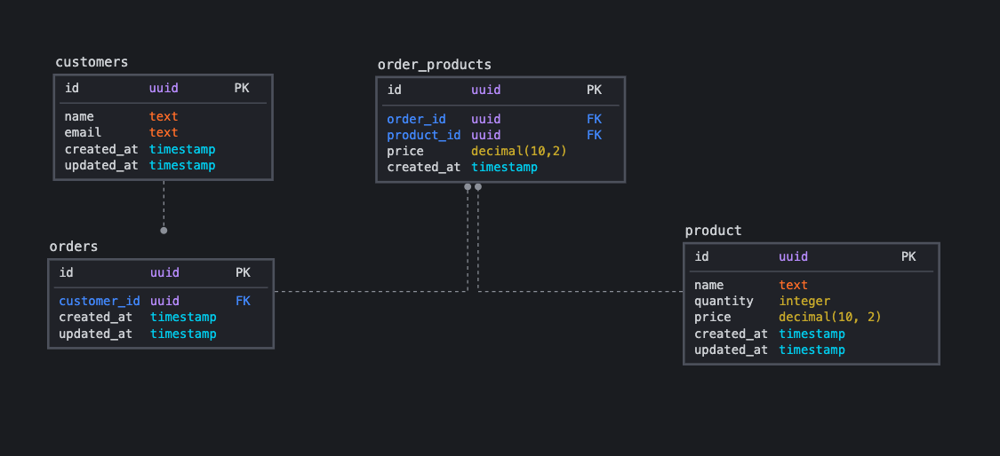

# Database relations

Desafio 09 GoStack: Database relations

Nesse desafio, você vai estar criando uma nova aplicação para aprender novas coisas e treinar o que você aprendeu até agora no Node.js junto ao TypeScript, incluindo o uso de banco de dados com o TypeORM, e relacionamentos ManyToMany!

# :pushpin: Table of Contents

* [Features](#rocket-features)
* [Database Model](#clipboard-features)
* [Learning Sources](#orange_book-learning-sources)
* [Installation](#construction_worker-installation)
* [Getting Started](#runner-getting-started)
* [FAQ](#postbox-faq)
* [Found a bug? Missing a specific feature?](#bug-issues)

# :rocket: Features

* 🛍&nbsp; Store orders, products and customers

# :clipboard: Database Model

<p align="center">
   
</p>

# :orange_book: Learning Sources

- [Relations in TypeORM](https://orkhan.gitbook.io/typeorm/docs/relations)
- [What are Many To Many Relations](https://typeorm.io/#/many-to-many-relations/what-are-many-to-many-relations)
- [Many to Many Entities in TypeORM](https://www.youtube.com/watch?v=RH_es0awU_A)
- [Saving Many to Many Relations with only one save call](https://typeorm.io/#/relations/cascades)

# :construction_worker: Installation

**You need to install [Node.js](https://nodejs.org/en/download/) and [Yarn](https://yarnpkg.com/) first, then in order to clone the project via HTTPS, run this command:**

```
git clone https://github.com/MayconRRibeiro/gostack-typeorm-relations.git
```

SSH URLs provide access to a Git repository via SSH, a secure protocol. If you use a SSH key registered in your Github account, clone the project using this command:

```
git clone git@github.com:MayconRRibeiro/gostack-typeorm-relations.git
```

**Install dependencies**

```
yarn install
```

Or

```
npm install
```

Create your enviroment variables based on the examples of ```.env.example```

```
cp .env.example .env
```

After copying the examples, make sure to fill the variables with new values.

**Setup a database**

Install [Postgres](https://www.postgresql.org/) to create a database or if you have [Docker](https://www.docker.com/) in your machine, fill the environment values related to database configurations and then run the following commands in order to create a Postgres container.

```docker-compose up```

# :runner: Getting Started

Run the transactions in order to configure the database schema

```yarn typeorm migration:run```

Run the following command in order to start the application in a development environment:

```yarn dev:server```

# :postbox: Faq

**Question:** What are the tecnologies used in this project?

**Answer:** The tecnologies used in this project are [NodeJS](https://nodejs.org/en/) + [Express Framework](http://expressjs.com/en/) to handle the server and [TypeORM](https://typeorm.io/#/)

# :bug: Issues

Feel free to **file a new issue** with a respective title and description on the the [TypeORM Relations](https://github.com/MayconRRibeiro/gostack-typeorm-relations/issues) repository. If you already found a solution to your problem, **I would love to review your pull request**!

---

Made with love by [Maycon Renan Ribeiro](https://github.com/MayconRRibeiro) 💜🚀
